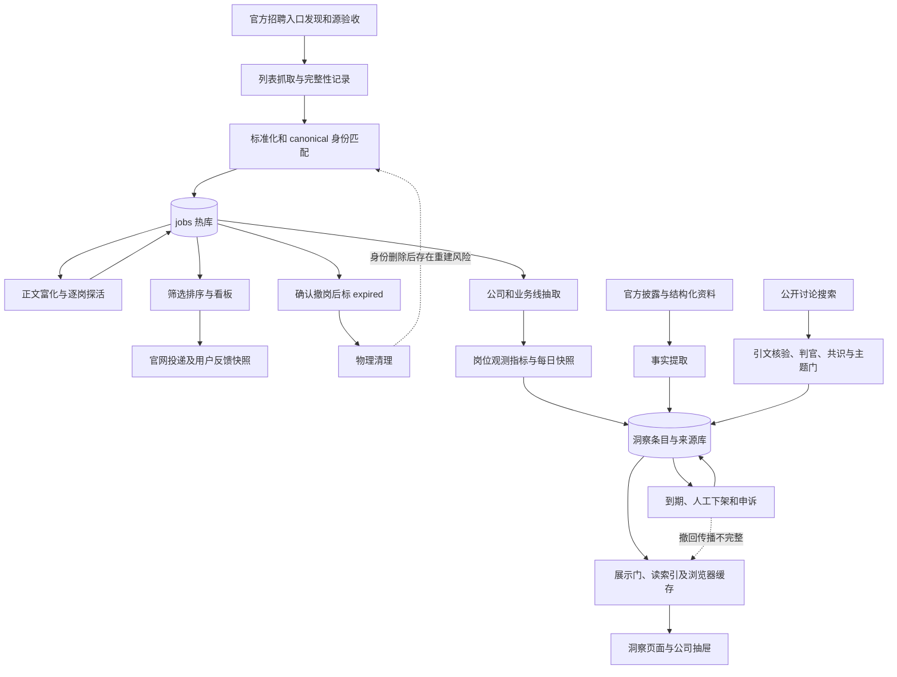
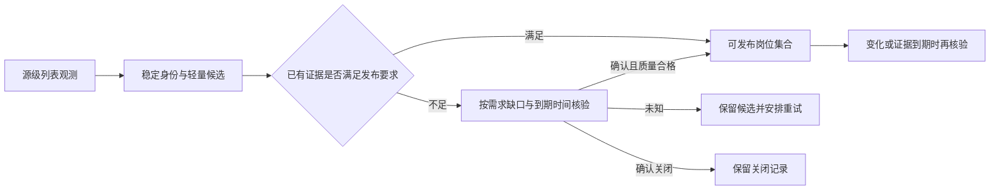

# 岗位库与洞察库：全生命周期后端补充审查

审查日期：2026-09-07。代码基线 `198c87c`（应用代码仍为 `1154512`）。这是[第一轮审查](2026-09-06-first-principles-review.md)的生命周期补充，包含设计建议，尚未实施或部署。

**结论：用户指出的方向成立。当前已经具备相当多的数据生产与治理能力，但跨任务的状态、证据、换代、撤回与重试约束不完整。多个上层问题共享这些根因。下一阶段应优先补齐两套数据生命周期，而不是继续增加供给脚本和展示规则。**

第一轮对岗位采集、判死、清理追得较深，对洞察更多检查了证据门和派生计算，没有完整串起生成、换代、纠错、缓存与失败重试。这份报告补上这一层。也不能把所有问题归因于数据库：前置召回与后置筛选口径不一致、候选查询过重仍需各自修正。

## 1. 判定标准、范围与分工

产品交付的是“值得用户行动、且能解释根据的信息”。因此一条数据至少要回答：它是谁，来自哪里，何时真正核验过，目前为何可见，何时该撤回，失败后怎样继续，以及纠错之后如何防止旧错误回来。

本轮分为岗位生命周期、洞察生产、洞察消费纠错三个代码审查方向，另由文档子 Agent 梳理调度合同、数据子 Agent 核查 Actions 业务输出；主 Agent 负责状态模型、故障注入、跨链结论与方案取舍。部分子 Agent 后续触及额度限制，主 Agent 接续消费端与事务边界检查；没有把未完成的子任务当成已通过。

证据分三层：当前代码可达路径；真实函数配合模拟 I/O 的反例；2026-09-07 02:20 UTC 取得的运行日志。日志时点早于报告完成时间，不代表当前实时存量。本轮没有连接生产数据库、触发业务 workflow、修改业务代码或生产数据。旧报告的生产快照不冒充本轮新测。

## 2. 两条链实际如何相连



这是逻辑关系，不是建议新增服务。jobs 热表在自建 PostgreSQL，sources、任务小表、用户数据和洞察在 Supabase。洞察有三种输入：岗位观测 signal、官方/结构化事实 fact、公开讨论 claim；不能把全部洞察都解释成岗位库的衍生品。

还有两个实际展示出口：`/api/insights` 会即时生成旧版岗位信号；洞察库读模型刻意排除 `origin=derived`，后台仍积累业务线指标和每日快照。前者的历史推断问题见原报告 F4，不能因后者已有快照就认定已经修复。依据：`app/api/insights/route.ts:97-145`、`lib/insight-library-store.ts:45-54`。

## 3. 岗位库的生命周期与断点

| 阶段 | 当前机制与主要代码 | 已成立的保护 | 未闭合的约束 |
|---|---|---|---|
| 发现与入源 | `auto_discover*.py`、`gap_funnel*.py`，探活、公司核名、真实岗位回读后启用 | 已有候选、验收、失败退避；不能说“猜源直接全入库” | 验收成功只证明当轮；持续覆盖仍依赖后续抓取与探活 |
| 采集与完整性 | `run.py:425-527`，adapter 抓取、URL 质量门、`reported_total/coverage_complete` | 共享分页可保留部分成果；不是所有失败都清空 | 部分自写分页丢前页；不完整抓取仍可能顶层 success；完整空源提前退出（原 F5） |
| 身份与更新 | `jobs_db.py:379-521`、`lib/jobs-store/write.ts:101-154`，canonical 匹配与 upsert | 已有行的 expired 黏住；列表空 summary 保留富化成果；removed 可复用原 id | 保护依赖旧行存在；物理删除后失去身份记忆。两端写入规则仍需一致 |
| 补正文与确认在招 | `enrich_backlog.py`、`audit_dead_links.py`、两条 liveness API | 点击直跳官网，异步质量校验不挡用户；JS 已有 alive/dead/unknown 三态 | Python 空返回兼容了正常与失败，浏览器不确定也盖核验戳；富化时间与存活确认混用（原 F3） |
| 确认撤岗 | detail 业务码/页面信号；少数已验证全集源可用 absence | 普通列表缺席不自动判死；有比例闸；华为非全集保护保留 | 全页裸 `404` 等信号会误杀（原 F2）；不能为了补空源处理而绕过全集与小源保护 |
| 事件与历史 | `jobs_db.py:273-375,516-521`、`write.ts:195-227` 的 `job_events` | 有 FIRST_SEEN/CLOSED/REAPPEARED 等里程碑与 event_key 幂等 | 主数据与事件分开提交，事件失败不阻断；事件还随岗位删除级联消失，不能用于完整回放或防复活 |
| 展示与反馈 | jobs-store → opportunities/search；用户 action 和岗位快照 | saved/applied 文本可在岗位清理后保留 | 新 UUID 重建会绕开旧 id 的反馈关联；快照不是岗位身份和存活证据的替代品 |
| 清理与恢复 | `purge-expired.yml:41-45` 直接删 expired；备份 runbook | 有真正执行的清理任务，释放正文存储 | canonical、关闭原因和事件一起消失，旧列表可重建死岗（原 F1）；恢复演练仍缺可引用验收证据（原 F7） |

岗位状态目前主要是 `active / removed / expired`。它们承载不了“是否确认在招、是否有足够正文、是否按时覆盖、是否人工否决、是否暂时查不到”全部语义。把这些概念都塞进 `status` 或一个 `enrich_checked_at`，就会出现“没查明白，却显得刚验证过”。

**建议的最小收口：**保留轻量的稳定身份和确认关闭记录，正文可以按现有回收目的清理；把探测结果明确为 alive/dead/unknown，分开尝试时间与正向确认时间；所有改变存活状态的写者调用同一数据库转换规则。关键关闭记录与转换同一事务写入，普通吞吐/耗时台账可以继续旁路。无需把所有日志改成强事务，也无需重建一套完整事件溯源系统。

重新开放需要新的、绑定该岗位的正向详情证据。一个旧列表再次返回同 URL 只说明“又看见了”，不应自动推翻已确认撤岗。如果官网复用职位编号，还需依据新发布日期/内容版本等明确证据建立新一轮招聘记录，并保留与旧身份的关联。

## 4. 洞察库的生命周期与新增确定缺口

| 阶段 | 当前机制 | 生命周期边界 |
|---|---|---|
| 建队列 | enabled sources 建公司画像；T2 90 天、T3 180 天的 checked 时间选队列，另有失败阈值 | 公司级时间戳不能表达每个主题完成到哪里 |
| 公司/业务线 | `bu_extract.py` 抽取主体；`rejected` 保留行供以后跳过，`retired` 可恢复 | rejected 的闭环值得复用；retired 的不同原因目前没有区分 |
| 采集核验 | T2 Wikidata/EDGAR/可选官方来源；T3 搜索→写手→判官→多域共识→主题门 | 有实质证据治理，但抓取错误、查无、预算延后未在编排层充分分开 |
| 入库与发布 | `insight_items` → `insight_sources` → 关联表分次写；年度报告另有来源更新逻辑 | 条目、来源、版本替换没有统一发布事务 |
| 换代与富化 | T3 新 active 出现后退役旧 public_web；grade 补档位；signal 原 id upsert | 替换粒度过大；同内容重试无稳定身份；人工退役可能被覆盖 |
| 展示 | `evaluateInsight` 统一证据门；洞察库索引和全文分开；公司抽屉另有会话缓存 | 新读通常能挡来源不足条目；浏览器缓存缺失撤回/重试期限 |
| 纠错与到期 | admin、dispute；`insight_sweep.py` 按 `valid_until` 下架 active | 人工撤回仅作用于旧 item id；pending 未纳入同样到期清理；时效门本身可以返回“可展示但已过时”，不能当作已下架 |
| 投稿旁路 | `insight_submissions`: pending→approved/rejected/retired；公司 API 聚合 approved | 这是独立的人工投稿通道，不是 T3 自动内容已经获人工审核 |

### I1 · P1：失败和额度不足也会推进长期复核时间

`insight_backlog.py:176-187` 把 Wikidata 异常改为 `facts=None`，随后记录 checked 并返回 noface。`502-591` 中 T3 的主题异常被 catch 后继续、预算不足直接 break，但结尾仍写 `t3_checked_at`。常规定时队列分别据此排除公司 90／180 天（`:99-106,319,450-464`）。手动点名仍可绕过队列，不能表述为技术上完全无法再刷新。

**已复现：**T2 注入超时，得到 noface 和新 checked；T3 LLM 余额为零，搜索调用为零，仍得到 empty 和新 checked。完整失败与真正“请求成功但查无”没有可靠区分。

**优化：**以主题/阶段记录 `last_attempt_at`、`last_success_at`、`next_retry_at` 和结果。预算耗尽为 deferred，预算恢复后可接续；网络失败短退避；真正成功查无才能使用合理的空结果 TTL。一次 partial 不得推进整公司的完整成功时间。已有失真的历史 checked 不可直接当真，也不可不分原因全部重置制造请求洪峰。

### I2 · P1：单主题成功会退役其他未完成主题的旧版

`insight_backlog.py:577-581` 只要求本轮出现一个 active，就按公司退役本轮之前所有 public_web active，没有 topic/metric 条件。部分主题失败或额度中途耗尽仍可走此分支。

**已复现：**“加班文化”成功，第二个主题抛异常，函数仍返回 wrote；退役条件只含公司、origin、status、时间，没有主题范围。未在生产注入失败，因此本轮没有量化真实误退役条数。

**优化：**以公司/主体、主题、范围和版本为发布单位。新主题版本及来源完整提交后，只替换它覆盖的旧主题版本；其他主题保留最近可信版本并显示其真实时点。请求失败不能解释为旧信息不成立。只有全部计划主题形成明确终态，才记整家公司本轮完成。

### I3 · P1：内容、出处与发布状态不在同一写入单元

T3 `write_experience():423-447` 先插 active/pending 条目，再逐条建 source 和关联；T2 `write_listing():129-140` 已存在时只改正文与 origin，不更新原出处。人工编辑 `app/api/insights/admin/route.ts:230-242` 也先改条目、删旧来源、再附新来源；附源失败可以只打印后继续（`:24-42`）。

**已复现：**source 插入抛错后内存库已留下 active item；旧 listing 升为 official 只发生 item update，完全没有来源更新；同一 claim quote 会被复制给 A/B 两个 source，即使引文实际只出自 A。

现有展示门能挡住许多来源不足条目，这是有效保护；所以不是“所有孤立 active 都会展示”。但它不能修复数据库里的残留、重试重复，或内容与旧出处错配。

**优化：**候选先核验，再通过一个数据库函数原子发布“条目版本＋各自来源＋关联＋主题换代”。每份摘录绑定它自己的来源；同一重试复用幂等键。外部搜索/模型调用放在事务外。PostgREST 的事务边界是单次请求，连续多个 `.execute()` 不会自动成为一个事务；可用一次 RPC 承载这组数据库写入。[PostgREST 事务文档](https://postgrest.org/en/stable/references/transactions.html)、[PostgreSQL 17 事务文档](https://www.postgresql.org/docs/17/tutorial-transactions.html)。

来源也应记录核验结果和适用时点，但“链接暂时打不开”不等于原事实为假：区分网络未知、证据被撤回、证据与断言矛盾、历史披露仍有效，再决定降级、过期或人工复核。不要再把岗位判死的三态错误复制到来源治理。

### I4 · P1：人工纠错缺少跨刷新延续的记忆

申诉成立只把旧 item id 改 retired（`app/api/insights/dispute/resolve/route.ts:37-55`）；T3 每次直接生成新 UUID（`insight_backlog.py:418`），没有读取此前申诉或等价内容的拒绝记录。`bu_signals.py:286-293,370-389` 则加载 active 和 retired 主体，并可把同 id 的 retired 指标再写 active。

**已复现：**同样 claim 调用两次产生两个新 id；retired 指标经真实计划函数输出同 id、active。前者证明没有重试身份/拒绝查询，不能据此声称某条线上被申诉内容已经复活。被 retired 主体的派生子项重活也不代表一定重新出现在洞察库卡片，因为索引另过滤主体状态。

**优化：**区分自动过期、被新版本替换、人工下架、申诉成立的原因；把人工裁定关联到公司/主体、主题、具体断言及证据版本，生产者在发布时检查。复用 subject rejected 的现有模式，但不能只凭换措辞后的文本哈希判断是全新说法，也不能永久封禁该公司的整个主题。新的相反证据需要明确复核，而不是自动覆盖裁定。

申诉状态更新和条目下架目前还是两次请求；第二次失败会留下“申诉成立但条目未下架”的中间状态。应放入同一次事务，失败时整体重试。

### I5 · P2：数据库撤回未形成所有展示出口的生效期限

`lib/insight-client.ts:42-88` 的 Map 命中后直接返回，没有 TTL、版本比较或清理入口；`CompanyInsightDrawer.tsx:123-138` 重开仍调这个缓存。公司抽屉与 SavedCompare 共用该路径。

**已复现：**模拟服务端第一次返回条目，之后已撤回，重开抽屉依然返回旧对象，HTTP mock 只调用一次。保持同一页面运行期间，数据库撤回不保证传到该缓存；JSON 形式错误响应也会进入同一缓存。

洞察库服务端则已有 10 分钟时间桶，卡面正文也会现读并过滤，不能一概说“全站缓存都不更新”；主体管理 API 也已有 `revalidateTag`。但条目管理/申诉等写入口没有同样统一的失效动作。

**优化：**所有发布、撤回、过期和申诉写入口使用统一的失效通知；公司响应带版本与到期时间，浏览器设短 TTL、重新打开/恢复焦点时复核，失败响应不长期缓存。先定义可验收的撤回时限（例如打开中的页面 60 秒内，是建议目标而非当前保证），再覆盖公司抽屉、对比页、洞察列表与详情的集成验证。

## 5. 应补齐的最小架构合同

下面是提案，不是已经新增的表/API 名称；实施时尽量扩展现有存储边界和函数。

| 合同 | 岗位侧 | 洞察侧 |
|---|---|---|
| 稳定身份 | canonical/官网职位标识与招聘轮次；正文清理不清身份和关闭证据 | 主体＋主题＋范围＋断言/证据版本；幂等重试不造重复版本 |
| 观测结果 | alive / dead / unknown；尝试时间与确认时间分开 | found / confirmed_empty / failed / deferred；检索成功和证据通过分开 |
| 合法状态转换 | 只有明确详情证据可关岗/重新开放；完整列表证据另走严格约束 | 已核验候选才能发布；partial 只换已覆盖主题；人工裁定优先 |
| 原子写入 | 存活转换＋关键证据/身份记录同一事务 | 版本＋来源＋关联＋换代或撤回同一事务 |
| 读取与撤回 | 看板读取可投投影；过旧/未知不伪装刚核验 | 统一展示门＋有效版本＋各端有界缓存 |
| 可恢复工作 | 分片完成度、游标、下次到期、失败原因 | 每主题完成度、未完成重试、pending 到期和人工处理队列 |
| 可复算历史 | 保存实际观测时间、源覆盖和口径版本 | 派生指标关联观测批次/覆盖范围，能解释重算前后变化 |

岗位到洞察是跨库派生，先保留这一边界。输出带输入批次、观测日期、覆盖与计算版本；失败可幂等重算。不要承诺一个数据库事务能跨越两个独立数据库，也不要把旁路事件当成完整历史。需要跨库通知时再用持久待办与对账解决遗漏。

## 6. 实施顺序与验收

| 顺序 | 工作包与责任 | 完成标准 |
|---|---|---|
| 1：止损 | 后端写入负责人：修 I1/I2；修岗位 unknown 盖戳和误判；明确所有破坏性转换条件 | 网络/预算失败不推进成功 TTL；第二主题失败不撤第一轮其他主题；unknown 不更新时间为已确认；普通正文中的 404 不判死 |
| 2：身份和发布 | 数据层负责人：岗位关闭记忆、洞察版本/来源事务、人工拒绝记录；各写入方接入 | purge 后旧列表不能重建在招死岗；重复运行不重复发布；故障注入到每一步均不留下半发布状态；人工裁定不被同证据刷新覆盖 |
| 3：接续与撤回 | 编排负责人：每阶段终态/重试；前后端共同负责版本失效 | 作业中断后只续未完成部分；deferred 可在预算恢复后再次入队；一条申诉在各展示面于约定期限生效 |
| 4：历史和恢复 | 数据工程/运维负责人：覆盖版本、观测快照、恢复演练及业务回读 | 明确观测变化与真实招聘变化的边界；恢复后身份、用户关联和发布版本一致；拿到实际演练记录 |

主 Agent/技术负责人负责两个领域的合同和验收；独立子任务分别实现写入、调度、消费端与测试，不让不同端自行定义“成功”“过期”“恢复”。生产修复需要隔离改动、迁移计划、只读基线和上线后回读；本次审查不执行这些修改。

验证重点应从“某函数绿了”扩展为跨阶段不变量：关闭→清理→重抓、一个主题成功另一个失败、插 item 后插 source 失败、人工撤回→自动刷新、缓存命中→申诉成立、任务中断→接续。这些用故障注入验证，不在生产人为制造故障。

## 7. 技术方案取舍

| 方案 | 收益与成本 | 判断 |
|---|---|---|
| 继续各脚本逐个补丁 | 局部修改小，但同一状态错误会在新 writer 再出现 | 可作紧急止损，不能作为最终治理方式 |
| 在现有 PostgreSQL/Supabase 边界收口身份、转换、发布与重试 | 复用 Python、Next.js、现有任务与展示门；需有限 schema/写接口调整及迁移验证 | **优先验证的候选方案；尚未证明架构最优，续审见 §9** |
| 全量改微服务、消息流、工作流平台或更换数据库 | 可能改善大规模调度，但迁移面大，依然要先定义以上业务语义 | 目前没有证据证明值得；外部工具不能替代生命周期合同 |

GitHub Actions 可以继续承担触发和执行。先把持久待办、到期时间、幂等和结果对账做好；若持续观测到积压、调度延误或并发竞争，再比较专用队列/执行器。跨任务配额的 read-modify-write 风险值得后续定向验证，本轮没有证明线上超额，不作为新增确定故障。

最主要的实施风险是误迁移历史状态、遗漏旁路 writer、以及一次性重试洪峰。先新增字段与兼容读法，核对写者清单，再逐条切换；来源不明的旧时间戳保留为历史未知。关键删除与补写关闭记忆必须同事务；不能先删正文再依赖另一个任务补记。

## 8. 本轮运行证据与验证边界

完整日志摘要见[调度取证](2026-09-07-evidence/operations.md)。T2/T3、档位提取、主体/信号派生、年报、时效清理均有最近一轮真实业务输出。T3 队列 53，本轮写入 7、empty 1 后因预留预算停止；这证明部分完成真实存在，不能据日志单独判断这些公司的 I1/I2 已触发。岗位侧列表更新、逐岗探活与 expired 清理也在运行。

新执行的定向回归：Python 147 项、Node 64 项，全部通过；另执行 7 个 Python 反例和 1 个 JS 缓存反例，均成功复现当前缺陷。反例成功不代表修复完成。使用本机 Python 3.9 运行，出现 LibreSSL 依赖警告；测试为 mock/纯函数，不代表生产 Python 3.11 环境或真实网络验证。

```bash
(cd crawler && python3 -m unittest test_insight_backlog test_insight_engine test_bu_signals test_bu_extract test_insight_sweep test_insight_assertion test_insight_topic_gate test_insight_topic_sweep test_insight_grade_extract test_insight_grade_scale)
node --test tests/insight-verification.test.js tests/insight-library.test.js tests/insight-submission-api.test.js tests/insights-pagination-contract.test.js
python3 docs/reviews/2026-09-07-evidence/insight-lifecycle-repro.py
node docs/reviews/2026-09-07-evidence/insight-cache-repro.js
```

没有重新查询生产洞察孤立行/误退役量，没有模拟生产申诉，没有完成恢复演练，也没有声称全仓回归或线上修复通过。当前结论足以确定补齐底层机制的优先级；生产影响量和迁移验收仍属于下一阶段实施工作。

## 9. 对架构本身的对抗性续审：假设所有 bug 都修好，再问一次是否该这样设计

续审基线 `6fe6fd7`，应用代码未变。两名代码审查子 Agent 分别挑战岗位生产模式与洞察证据模型；主 Agent 比较读路径、调度与存储替代方案。以下是设计判断与待验证假设，不是假装已经运行过的架构对拍。

### 9.1 收紧前序结论：能保留工具，不等于应保留数据流

前两轮的故障注入能证明实现存在反例，也能证明某些局部保护必要；它们不能证明“把这些 bug 修好，整体方案就是最好”。前述“保留现有栈”只能解释为没有理由立即重写语言和框架，不能替当前的发布模式、检索计算位置、双库边界和固定主题生成方式背书。

判断方案时先定不能牺牲的要求：投递硬条件准确、未知不得假装确定、纠错可生效、原始机会不因技术过滤被无声漏掉。然后在同样目标范围内比较可核验机会覆盖、信息时效、响应时间、持续运行成本和维护成本。“已有代码很多”不构成优势；未来迁移成本与新增故障面则是必须计算的真实成本。

### 9.2 岗位生产：为什么列表记录可以直接获得发布资格？

**当前事实。** `daily-crawl.yml:85-104` 将快档 detail cap 设为 0；`normalizer.py` 的质量门主要核标题和 URL，标准化默认 active。之后由富化、探活和展示过滤治理。部分列表本来就能给出完整正文和明确状态，部分只给骨架且夹带关闭岗，不能给两者相同的证据地位。当前确有首屏读取只要求 active 的路径（`lib/jobs-store/read.ts:533-547`）。

**即使没有 bug，设计仍有代价。** 未经充分核验的候选先进入发布集合，正确性就依赖后台修补赶在用户看到之前完成。随着来源扩张，新增验证需求与存量到期复检共同争用预算；后台不断工作不代表能长期追上。需比较的是唯一岗位的验证需求与真实完成容量，重复 upsert 行数不是新增需求量。

**更值得验证的数据流：**



不要求所有来源都增加逐岗 HTTP：列表本身证据充分的可直接过门。保留源级完整观测与岗位身份，按多个用户的需求并集、明确缺口和到期风险分配昂贵核验；不按一个用户当下偏好永久删除其他候选，也保留长尾探索和主动点名路径。候选等待及过期必须可见，不能把“没来得及验证”统计成“没有岗位”。

对高量来源进一步比较增量模式：按 new/changed/unchanged/absent 分组，仅对新增、变化和证据到期岗位做相应工作。**列表不变不能证明仍在招**，到期探活仍保留；不完整列表也不能提供缺席撤岗证据。候选数据与发布数据可以先用现有表的独立字段/投影表达，不必立即拆成多个新服务。

**如何推翻这个建议：**若按平台实测列表直接发布的误差已在目标范围内、验证排队反而让大量短期开岗错过时机、且成本没有下降，则该平台保留直接发布。应按平台证据能力选择路径，不能为架构整齐强制全源同流程。新方案需在相同目标公司/职位方向、同等核验预算下，比原链更少展示不可投岗位，同时不增加真实机会漏失与不可接受的新岗延迟。

### 9.3 洞察生产：两个链接、模型认可，凭什么足以支持用户决策？

这里不把现有 claim 误称为 fact；代码已经区分二者。挑战在于：一条归因正确的公开说法，是否仍被聚合、分档和挂到公司上，形成超出证据范围的暗示。

| 需要质疑的假设 | 当前依据与反例 | 更合理的边界 |
|---|---|---|
| 两个注册域名足以代表独立佐证 | 共识门按注册域名计数：`insight_engine.py:275-279`、`insight-verification.ts:95-121`。同一原始说法在两域转载仍可能计为 2 | 域名只作为线索；区分独立原始观察、转载、同一事件与相互引用。血缘未知就明确未知，不宣称已获得独立共识 |
| 文本支持一句话，就支持公司级/目标岗位级推断 | judge 核公司、维度和文本支持；T3 写入缺少细分 `subject_id/scope`（`insight_backlog.py:423-437`） | 某业务线员工的奖金经历，只支持该范围内的归因观察；不能自动成为其他团队/职级的预期。两份关于裁员的报道也不直接等于未来稳定性评级 |
| judge 的自报分数是外部真实性概率 | writer/judge 复用 `chat_json`；`final_status` 使用判词、置信与域名数（`insight_engine.py:265-322,367-413`），展示另有门 | 二次模型检查能降错，但不会增加新的原始证据。未在独立标注集校准前，不把 0.9 解释为“90% 真实”；文本蕴含与能否外推分开验收 |

**新隔离反例已执行：**两条 URL 来自不同域，短摘录为同一转载内容，`countDistinctPublishers=2`、`passesClaimGate=true`。它只证明这一道门不检验证据独立性，不代表整条生成链一定会发布，也没有量化线上转载比例。复现：`node docs/reviews/2026-09-07-evidence/insight-evidence-independence-repro.js`。

**主张调整数据本体：**把可追溯的证据观察及其版本作为长期记录，生成文案作为可重建的展示结果。保存来源地址、发布时间/采集时间、适用范围、短摘录与对应位置、来源血缘线索、内容/规则/模型版本、人工裁定；遵守既有去标识与不保存完整 UGC 的边界。版本化证据本身也不保证真实，仍要保留分歧和未知。

三种方案需要实际比较：A 保持定期公司主题生成；B 增量收集证据，证据足够时生成并缓存解释；C 自动产出集中于可直接核验的高价值官方主题。**建议优先验证 B，并把 C 作为其中的优先路径；经验观察继续保留。** 不默认全部经验内容只能内部看，也不让用户每次打开页面等待 LLM：先显示已有证据与缓存解释，新增解释异步生成。尚未测得三者的总成本或覆盖优劣，不能预先宣称哪种最便宜。

验收语料至少包括：同稿转载、同一匿名帖被多站引用、真正独立但结论相反的经历、事实成立但业务线/职级不匹配、来源支持但已过适用期、官方发布但只代表发布者主张。逐项标注归属、支持程度、范围、血缘与冲突；比较“直接展示证据”和“加生成摘要”后读者是否更容易作出正确判断。若摘要没有提高理解或反而扩大误导，应撤掉该主题的自动总结。

### 9.4 检索：为什么每次请求还要搬运大量正文才能知道哪些岗位匹配？

**当前事实。** Jobs match 路径仍最多取 28,000 候选，候选带 summary，应用端精筛排序后分页（`lib/jobs-store/search.ts:124-126,488-541`）。已有过滤下推、列投影、进程缓存和最终页回填，不能称为完全没优化。但冷实例仍需读取大量候选正文；Today 则取截断正文（`lib/jobs-store/opportunities.ts:69-77`）。这让效率和正文语义完整性相互牵制。

**优先比较的结构调整：**岗位内容变化时计算有版本的岗位特征与检索表示；请求时先用可索引的硬条件和轻量特征召回、排序，再补最终页正文。保留一次解析供多次请求复用，不把每个请求都变成小型数据清洗任务。无须先换搜索引擎。

这不是简单删除 summary：岗位职能、同名词排除、正文届别和查询相关匹配必须有等价特征或受控全文检索兜底。用户偏好与随时间变化的届别/失效判断仍在查询时正确应用。应用解析不能直接塞进 SQL generated column；后者只允许符合 immutable 等条件的行内表达式，应按逻辑选择写入计算、后台特征更新或数据库表达式。[PostgreSQL 17 生成列约束](https://www.postgresql.org/docs/17/ddl-generated-columns.html)。

**验收与反证：**同一冻结岗位集和查询集，对照完整正文的权威硬门，比较候选召回、最终排序、传输字节、冷暖延迟和维护成本。先用小范围影子读证明不漏掉正文中的关键条件；新特征版本未完成时保留旧路径。若特征维护成本超过复用收益，或无法控制语义漏失，就不能仅凭更快采用它。重试、缓存与并发调整仍有用途，但不能代替这个数据形态的比较。

### 9.5 定时任务与双库：历史选择也必须重新承担举证责任

**调度对比。** 当前已有分片、若干 concurrency、台账及重试，不能说只有裸 cron。不过固定时间跑完一个脚本，不是“哪些实体现在最值得做、未做完如何续上”的完整答案。比较“现有各脚本选队列＋cron”与“持久到期待办＋短租约领取＋幂等执行＋结果对账”。后者可以继续让 Actions 当执行器，也可以换执行器；选择标准是漏执行、恢复时间、任务新鲜度和运维成本。

PostgreSQL 的 `SKIP LOCKED` 可用于多消费者队列领取，但不能用于需要完整一致视图的一般查询；任务仍需租约过期、幂等和失败补偿，不能承诺恰好执行一次。[PostgreSQL 17 SELECT 文档](https://www.postgresql.org/docs/17/sql-select.html)。这些能力是否自建到数据库、还是交给托管队列，应比较工作量和可靠性后决定。

**存储边界对比。** jobs 在一库、sources 和洞察在另一库，造成实际跨库依赖：召回后还要读来源元信息，派生洞察要跨库取岗位，验收/清理也不能靠单事务兜住。`lib/opportunities/service.ts:73-108` 就是来源元信息独立查询的一处路径。已有分库理由不等于该边界应永久固定。

| 选项 | 可能收益 | 必须承担的成本/风险 |
|---|---|---|
| 保持当前权威库分布，补契约和恢复 | 迁移最少，现有权限和运维关系延续 | 跨库失败路径与对账长期保留，不能只靠 catch |
| 权威库不动，将查询需要的来源/发布状态投影到岗位读取侧 | 减少关键请求的跨库依赖 | 多一份副本、同步延迟、禁用状态传播与对账；必须有生效期限 |
| 将经常一起处理的公开业务数据归入同一个业务库，认证仍可托管 | 关联与领域事务更直接，减少部分同步问题 | 迁移、权限、备份和运行故障集中；不是简单搬表就完成 |

三项都需要纳入候选。当前没有本轮成本/故障对拍支持“分库一定最好”，也没有证据支持立即合库。比较维度是未来总成本、实际依赖与可恢复性，不能只看数据库个数。

### 9.6 本轮架构判断与完成边界

**应调整的是后端的职责划分：列表观测与可发布岗位分开，证据与生成文案分开，写入时可复用的解析与请求时的用户决策分开，调度触发与任务完成分开。** 这是修完局部 bug 以后仍值得做的结构调整候选。是否改变物理表、进程、数据库或云服务，再由同条件对照决定。

下一步优先做两个能否定自己的小范围对拍：选协议能力不同的来源，比较直接发布与两阶段/增量发布；选来源可追溯的同一批主题，比较证据直出与生成摘要。并行验证轻量检索投影；持久队列和库边界按测出的主要瓶颈决定。所有方案必须同时报告减少了什么错误、引入了什么漏失/延迟、总成本如何变化；达不到就撤回候选方案。

本节没有实施重构或新的生产性能测试。新增反例只验证了共识门的能力边界；§8 的 211 项测试是上一轮已运行记录，不是本节又跑了一遍。报告给出了对现有设计的实质挑战与可证伪替代方案，尚未把任何替代方案认证为“最优”。
